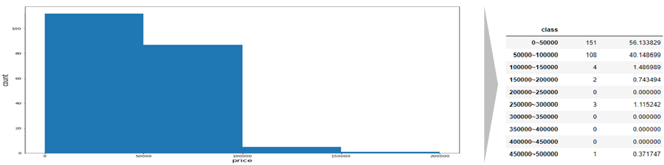

## 데이터 시각화 프로젝트

#### 1.Project

- 관광객 수 증감에 대한 원인 분석 및 해결방안 모색

#### 2. Description

- 코로나 어쩌구 선정된 5개 도시의 관광 인프라 

#### 3. Role

- 주요 관광지역 인프라 데이터 크롤링
- 데이터 전처리
- 수집 정보 시각화

#### 4. Skill

- Python
- Bs4
- Selenium
- Pandas
- Matplotlib
- Folium

#### 5. Outputs

1. 주요 관광지별 방문자 수
   - 등락 폭이 가장 큰 목포,전주를 대상 도시로 선정

2. 목포,전주 숙박업소 가격 정보(boxplot)

   

   3. 목포,전주 숙박업소 가격 정보(histogram)

4. 목포,전주 소비자물가등락률, 소비자물가지수

5. 주요 관광지간 최단거리 평균

| **출처**                                                     | **데이터이름**                            | **제공형태**    | **요약**                                                     |
| :----------------------------------------------------------- | :---------------------------------------- | :-------------- | ------------------------------------------------------------ |
| 구글  호텔 https://www.google.com/travel/hotels/             | 지역별  숙박업소 가격 정보                | 웹  크롤링(CSV) | 지역별  숙박업소의 가격정보를 웹 크롤링을 통해 조사          |
| 구글여행정보     https://www.google.com/travel               | 지역별  대표 관광지 정보                  | 웹  크롤링(CSV) | 지역별  대표 관광지의 정보를 웹 크롤링을 통해 조사           |
| 네이버지도     https://www.map.naver.com                     | 지역별  대표 관광지 인근 버스 정류장 정보 | 웹  크롤링(CSV) | 지역별  대표 관광지 인근 버스 정류장 정보를 웹 크롤링을 통해 조사 |
| 한국관광  데이터랩     https://datalab.visitkorea.or.kr/datalab/portal/bda/getByRegnAna.do | 지역별  방문자수 비교                     | API(CSV)        | 지역별  연간방문자 수 통계                                   |
| 공공데이터포털     https://www.data.go.kr/data/15012896/standard.do | 거점도시공영주차장                        | API(CSV)        | 지역별  공영주차장 정보                                      |
| 구글여행정보     https://www.google.com/travel               | 관광지  위도 경도                         | 웹  크롤링(CSV) | 구글맵스를  이용해 관광지의 위도 경도를 추출                 |
| 구글여행정보     https://www.google.com/travel               | 관광지  사이 거리                         | 웹  크롤링(CSV) | 관광지  위도 경도를 계산해 관광지 사이 거리를 계산           |
| 트립어드바이저     https://www.tripadvisor.co.kr/Attractions-g1074117-Activities-Mokpo_Jeollanam_do.html | 목포  주요 관광지                         | 웹  크롤링(CSV) | 목포  주요 관광지에 대한 정보를 csv 파일로 제공받은 후 일부 추출 |
| 네이버지도     https://naver.com                             | 진도  주요 관광지                         | 웹  크롤링(CSV) | 진도  주요 관광지에 대한 정보를 웹 서치 후 일부 추출 csv 파일 변환 |
| 국가통계포털     https://kosis.kr/search/search.do           | 소비자물가지수                            | API(CSV)        | 소비자물가지수  정보를 csv  파일로  제공받은 후 시각화 작업  |
| 국가통계포털     https://kosis.kr/search/search.do           | 소비자물가등락률                          | API(CSV)        | 소비자물가등락률  정보를 csv  파일로  제공받은 후 시각화 작업 |
